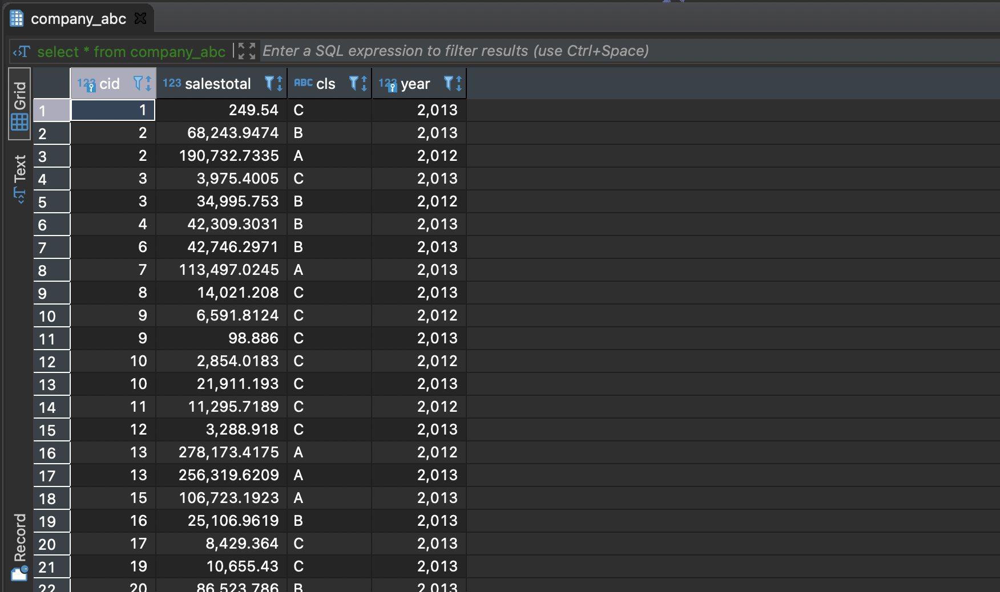
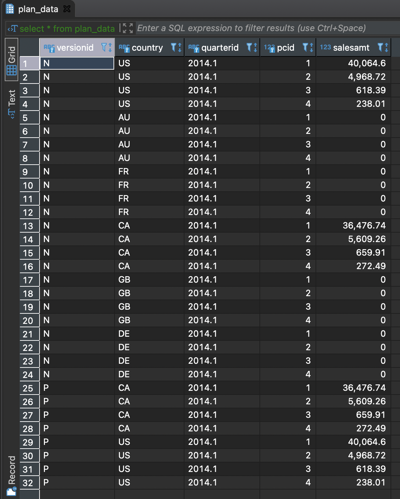

### Task No1. Access settings

```sql
/* Set up permissions for roles
 * Create three users: Administrator (ivan), Managers: (sophie, kirill)
 * Manager sophie has access to data of US and CA countries. 
 * Manager kirill works with sales data in FR, GB, DE, AU countries. 
 * Put this information in the ‘country_managers’ table, which stores data about 
 * the anchoring of managers for certain countries.
 */

grant usage on schema public to planadmin;
grant usage on schema public to planmanager;

grant select on all tables in schema public to planadmin;
grant select on all tables in schema public to planmanager;

grant select, insert, update, delete on plan_data to planadmin;
grant select, insert, update, delete on plan_data to planmanager;

grant select, insert, update, delete on plan_status to planadmin;
grant select, update on plan_status to planmanager;

grant select, insert, update, delete on country_managers to planadmin;
grant select on country_managers to planmanager;

grant select, update on v_plan_edit to planmanager;
grant select on v_plan to planmanager;

--drop user ivan;
create user ivan with password 'ivan_pwd';
grant planadmin to ivan;

--drop user sophie;
create user sophie with password 'sophie_pwd';
grant planmanager to sophie;

--drop user kirill;
create user kirill with password 'kirill_pwd';
grant planmanager to kirill;

insert into country_managers (username, country) values 
('sophie', 'US'), ('sophie', 'CA'), ('kirill', 'FR'), ('kirill', 'GB'), ('kirill', 'DE'), ('kirill', 'AU');
```

```sql
insert into country_managers (username, country) values 
('sophie', 'US'), ('sophie', 'CA'), ('kirill', 'FR'), ('kirill', 'GB'), ('kirill', 'DE'), ('kirill', 'AU');
```

### Task No2. product2 & country2 materialized views

```sql
--drop materialized view if exists product2;

--select * from product p;
--select * from productcategory p;
--select * from productsubcategory p;
--select * from address a;


/* The ‘product2’ view should contain the product and its category. */

create materialized view product2 as
    select 
    	pc.productcategoryid	as pcid, 
    	p.productid 			as productid,
    	pc.name 				as pcname, 
    	p.name 					as pname 
    from product p
    join productsubcategory psc on p.productsubcategoryid = psc.productsubcategoryid
    join productcategory pc on psc.productcategoryid = pc.productcategoryid 
with no data;

refresh materialized view product2;


--drop materialized view if exists country2;

--select * from address a2;
--select * from customeraddress c;
--select * from customer c;

/* select distinct a.countryregioncode from customer c 
 * join customeraddress ca on c.customerid = ca.customerid 
 * join address a on ca.addressid = a.addressid
 * where ca.addresstype = 'Main Office';
 */


/* The ‘country2’ view should be filled with unique codes of the countries 
 * where the shops are located (the type of address is Main Office). */

create materialized view country2 as
	select distinct a.countryregioncode from customer c 
	join customeraddress ca on c.customerid = ca.customerid 
	join address a on ca.addressid = a.addressid
	where ca.addresstype = 'Main Office'
with no data;
		
refresh materialized view country2;


/* Allow managers and administrators to read from these views. */

grant select on product2 to planadmin;
grant select on product2 to planmanager;

grant select on country2 to planadmin;
grant select on country2 to planmanager;

```

### Task No3. Loading data into the company table

```sql
--select * from customer c;
--select * from company c;
--select * from customeraddress c;
--select * from address a;


/* In the current database the customer table contains information about two 
 * categories of buyers - individuals and companies. However, we consider only companies. 
 * For the convenience of further development, fill the company table with data.
 * Data from the companyname field should be included in the list of companies. 
 * The country and the city should be taken from the address table. Develop a query to 
 * load the country table. */
 
insert into company (cname, countrycode, city)
	select distinct
		c.companyname as cname, 
		a.countryregioncode as countrycode, 
		a.city as city
	from customer c
	join customeraddress ca on c.customerid = ca.customerid 
	join address a on ca.addressid = a.addressid 
	where ca.addresstype = 'Main Office';
```

### Task No4. Company classification by annual amount of orders

```sql
--select * from salesorderheader;
--select * from customer;
--select * from company_abc;
--select * from company;
--truncate table company_abc;


/* Split the companies into three groups according to algorithm in 
 * section 1.5 (on page 5) for 2012 and 2013. Fill in the ‘company_abc’ table using SQL query. 
 * All calculations should be done in one query. */

insert into company_abc (cid, salestotal, cls, year)
	select 
		cid, 
		salestotal,
		case 
			when srt <= (yeartotal * 0.80) then 'A'
	    	when srt <= (yeartotal * 0.95) then 'B'
	    	else 'C' end as cls,
	    year
	from (
		select
			cid, 
			salestotal,
			yeartotal,
			df.year,
			sum(salestotal) over (partition by df.year order by salestotal desc) as srt
		from (
			select 
				cmp.id as cid,
				sum(soh.subtotal) as salestotal,
				date_part('y', soh.orderdate) as year
			from salesorderheader soh
			join customer ctr on soh.customerid = ctr.customerid 
			join company cmp on cmp.cname = ctr.companyname
			where date_part('y', soh.orderdate) in (2012, 2013)
			group by cid, year
		) as df
		join (
			select
				sum(soh.subtotal) as yeartotal, 
				date_part('y', soh.orderdate) as year 
			    from customer cmr
			    inner join company cmp on cmr.companyname = cmp.cname
			    join salesorderheader soh on cmr.customerid = soh.customerid
			    where date_part('y', soh.orderdate) in (2012, 2013)
			    group by year
		) as ys on df.year = ys.year
	) as df
	order by cid;
```

Table 'company_abs'


### Task No5. Finding quarterly sales amount by company, and product category

```sql
--select * from company_sales cs;
--select * from company_abc ca;
--select * from salesorderdetail sod;
--select * from salesorderheader s;


insert into company_sales (cid, salesamt, year, quarter_yr, categoryid, ccls, qr)
	select 
		dt.cid,
		dt.salesamt,
		dt.year,
		dt.quarter_yr,
		dt.categoryid,
		cabs.cls as ccls,
		dt.year || '.' || quarter_yr as qr
	from (
		select
			cmp.id as cid,
			sum(sod.linetotal) as salesamt,
			extract(year from soh.orderdate) as year,
			extract (quarter from soh.orderdate) quarter_yr,
			p2.pcid categoryid
		from salesorderdetail sod
		join salesorderheader soh on sod.salesorderid = soh.salesorderid
		join customer cmr on soh.customerid = cmr.customerid
		join company cmp on cmr.companyname = cmp.cname
		join product2 p2 on sod.productid = p2.productid
		where date_part('y', soh.orderdate) in (2012, 2013)
		group by cid, year, quarter_yr, categoryid
	) as dt
	join company_abc cabs on (cabs.cid  = dt.cid and cabs.year = dt.year);
```

### Task No6. Initial data preparation

```python
def start_planning(year, quarter, user, pwd):
    #  Delete plan data from the plan_data table related to the target year and quarter.
    #  In the plan_status table delete records related to the target quarter.
    sql_delete_plan_data = 'delete from plan_data where quarterid = %(quarterid)s;'
    sql_delete_plan_status = 'delete from plan_status where quarterid = %(quarterid)s;'

    # Create planning status records (plan_status table) for the selected quarter.
    # The number of records added equals the number of countries in which customer-companies
    # (shops) are situated.
    sql_create_plan_status = '''
        insert into plan_status (quarterid, status, modifieddatetime, author, country)
            select
                %(quarterid)s 		as quarterid, 
                'R'::text 			as status,
                now()				as modifieddatetime,
                user 				as author,
                countryregioncode 	as country
            from country2;'''

    # Generate version N of planning data in the plan_data table. Use the calculation algorithm
    # is described in section 1.4. on the page.
    sql_create_plan_data = '''
        insert into plan_data (versionid, country, quarterid, pcid, salesamt)
            select 
                'N'::text 					as versionid,
                country						as country,
                year || '.' || quarter_yr 	as quarterid,
                pcid						as pcid,
                case 
                    when (salesamt_year_early + salesamt_year_later) is not null
                    then (salesamt_year_early + salesamt_year_later) / 2 else 0
                    end as salesamt
            from (
                select 
                    df.country 								 as country,
                    df.year 								 as year,
                    df.quarter_yr 							 as quarter_yr,
                    df.pcid 								 as pcid,
                    avg_sales_year_early.salesamt_year_early as salesamt_year_early,
                    avg_sales_year_later.salesamt_year_later as salesamt_year_later
                from (
                    select 
                        countryregioncode 		as country,
                        %(year)s::dec	 		as year,
                        %(quarter_yr)s::dec 	as quarter_yr,
                        pc.productcategoryid 	as pcid
                    from country2
                    cross join productcategory pc) as df
                left join (
                    select
                        avg(cs.salesamt) 	as salesamt_year_early,
                        cs.year + 2			as year,
                        cs.quarter_yr 		as quarter_yr,
                        cs.categoryid		as pcid,
                        cmp.countrycode 	as country
                    from company_sales cs
                    join company cmp on cs.cid = cmp.id
                    where cs.ccls != 'C'
                    group by year, quarter_yr, pcid, country
                ) as avg_sales_year_early
                on (
                    avg_sales_year_early.country 	= df.country and 
                    avg_sales_year_early.year	 	= df.year and
                    avg_sales_year_early.quarter_yr = df.quarter_yr and
                    avg_sales_year_early.pcid 		= df.pcid)
                left join (
                    select
                        avg(cs.salesamt) 	as salesamt_year_later,
                        cs.year + 1			as year,
                        cs.quarter_yr 		as quarter_yr,
                        cs.categoryid		as pcid,
                        cmp.countrycode 	as country
                    from company_sales cs
                    join company cmp on cs.cid = cmp.id
                    where cs.ccls != 'C'
                    group by year, quarter_yr, pcid, country
                ) as avg_sales_year_later
                on (
                    avg_sales_year_later.country = df.country and 
                    avg_sales_year_later.year = df.year and
                    avg_sales_year_later.quarter_yr = df.quarter_yr and
                    avg_sales_year_later.pcid = df.pcid)
            ) as dt;'''

    # Copy data from version N into version P in the plan_data table.
    sql_copy_plan_data = '''
        insert into plan_data (versionid, country, quarterid, pcid, salesamt)
            select 
                'P'::text 	as versionid,
                country,
                quarterid,
                pcid,
                salesamt
            from plan_data pd
            where pd.quarterid = %(quarterid)s and versionid = 'N' and salesamt > 0;'''

    quarterid = str(year) + '.' + str(quarter)

    with psycopg2.connect(dbname=db_name, user=user, password=pwd, host=db_host, port=db_port) as conn:
        with conn.cursor() as cursor:
            try:
                cursor.execute(sql_delete_plan_data,    {'quarterid': quarterid})
                cursor.execute(sql_delete_plan_status,  {'quarterid': quarterid})
                cursor.execute(sql_create_plan_status,  {'quarterid': quarterid})
                cursor.execute(sql_create_plan_data,    {'quarter_yr': quarter, 'year': year})
                cursor.execute(sql_copy_plan_data,      {'quarterid': quarterid})
            except Exception as err:
                print(f'Error: {err}')

                # rollback the previous transaction before starting another
                conn.rollback()

                return False
            
            else:
                conn.commit()

    return True
```

Write a line with function call that you used to populate the plan_data and plan_status tables

```python
start_planning(2014, 1, 'ivan', 'ivan_pwd')
```

Table 'plan_data'



Table 'plan_status'


### Task No7. Changing the plan data

```python
# set_lock(year, quarter, user, pwd), which will change status from R to L
# for data slices, that are associated with the target quarter and year,
# and connected to the current user in the country_managers configuration table.
# To obtain the name of the current user, use current_user. Also write a timestamp
# of modification to the modified datetime field.
def set_lock(year, quarter, user, pwd):
    sql_set_lock = '''
        update plan_status 
        set 
            status = 'L',
            modifieddatetime = current_timestamp,
            author = current_user
        where
            quarterid = %(year)s || '.' || %(quarter_yr)s and 
            country in (
                select country from country_managers 
                where username = current_user 
            ) and 
        status = 'R';'''

    with psycopg2.connect(dbname=db_name, user=user, password=pwd, host=db_host, port=db_port) as conn:
        with conn.cursor() as cursor:
            try:
                cursor.execute(sql_set_lock,    {'quarter_yr': quarter, 'year': year})

            except Exception as err:
                print(f'Error: {err}')

                # rollback the previous transaction before starting another
                conn.rollback()

                return False

            else:
                conn.commit()

    return True
```

```python
# remove_lock(year, quarter, user, pwd) function, that will change the
# planning data status from L to R. associated with the current user through
# the country_managers table. Write a change time stamp in the modified datetime field.
def remove_lock(year, quarter, user, pwd):
    sql_remove_lock = '''
        update plan_status 
        set 
            status = 'R',
            modifieddatetime = current_timestamp,
            author = current_user
        where
            quarterid = %(year)s || '.' || %(quarter_yr)s and 
            country in (
                select country from country_managers 
                where username = current_user 
            ) and 
        status = 'L';'''

    with psycopg2.connect(dbname=db_name, user=user, password=pwd, host=db_host, port=db_port) as conn:
        with conn.cursor() as cursor:
            try:
                cursor.execute(sql_remove_lock,    {'quarter_yr': quarter, 'year': year})

            except Exception as err:
                print(f'Error: {err}')

                # rollback the previous transaction before starting another
                conn.rollback()

                return False

            else:
                conn.commit()

    return True
```
