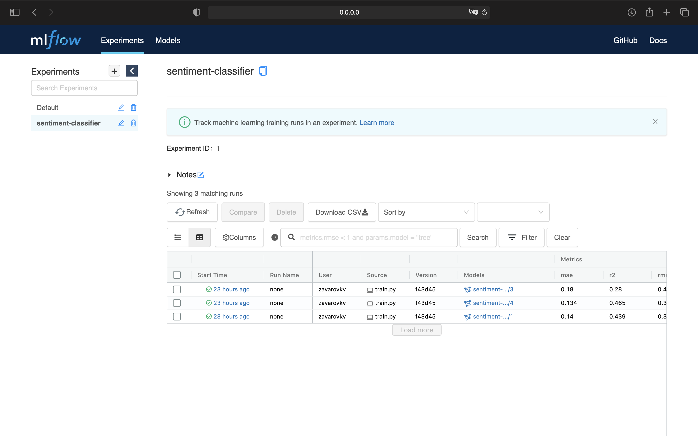
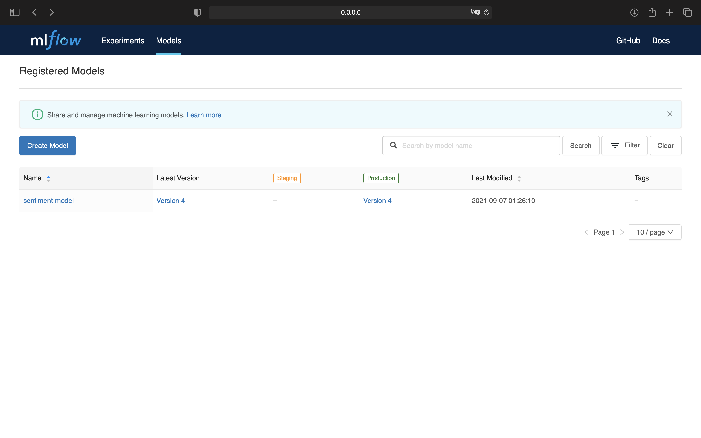
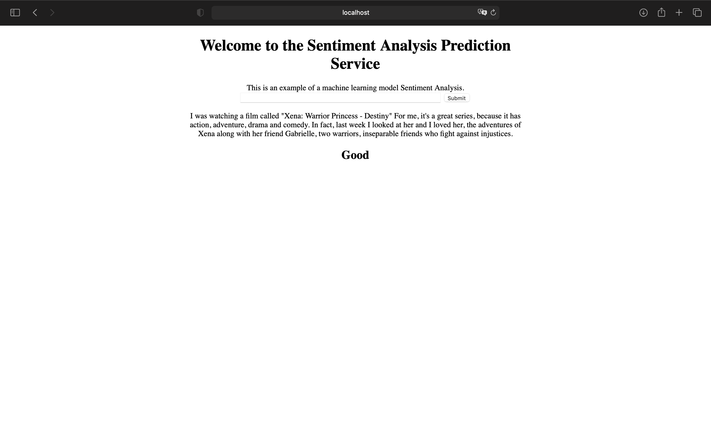

# Dockerized Model Training with MLflow and Flask web-server

## Overview
* Example of train and score a MLflow project with Flask web-app for text sentiment analysis.
* This work done as a Final Project for MLSML2 HSE course.
* The model is contained two models:
  * [DestilBERT model](https://metatext.io/models/distilbert-base-uncased) processes the sentence and passes along some information it extracted from it on to the next model.
  * The next model, a basic Logistic Regression model from scikit learn will take in the result of DistilBERT’s processing, and classify the sentence as either positive or negative.
* Dataset: [SST2](https://nlp.stanford.edu/sentiment/index.html), which contains sentences from movie reviews, each labeled as either positive or negative.
  * Directory for dataset: `data/SST2/`

## Project Structure 

~~~
sentimental-classifier
├── data
│   └── SST2
│       ├── dev.tsv
│       ├── test.tsv
│       └── train.tsv
├── server
│   ├── templates
│   |   └── index.html
│   └── server.py
├── Dockerfile
├── MLProject
├── train.py
├── register_model.py
├── test.py
└── README.md
~~~

## Training

### 1. Run MLFlow server
```
mlflow server \
    --backend-store-uri sqlite:///mlflow.db \
    --default-artifact-root ./artifacts \
    --host 0.0.0.0
```

### 2. Run experiments
For simplify train model could be run `test.py`, which run `train.py` with different params.
```
python train.py --experiment_name sentiment-classifier \
  --c 5.2 --max_iter 100 --data_path data/SST2/test.tsv 
```
Or could use MLProject for run experiment like this:
```
mlflow run . \
  -P data_path=data/STS2/test.tsv \
  -P c=5.2 \
  -P max-iter=100 \
  -P experiment-name=sentiment-classifier
```
Then we can check our experiments in MLflow UI


For every experiments calculates `MAE`, `R2`, `RMSE` for each model input params.

### 3. Register the model
Find the best run and register it as production version of model ```models:/sentiment-classifier/production```:
```
python register_model.py --experiment_name sentiment-classifier \
  --model_name sentiment-model
```
Best experiment — experiment witch has minimal `RMSE`:
```
runs = client.search_runs(exp.experiment_id, order_by=["metrics.rmse ASC"], max_results=1) 
```


### 4. Build Docker Container
```
mlflow models build-docker \
  --model-uri models:/sentiment-model/production \
  --name dk-sentimental
```

### 5. Run web-server with FLask
Server will run on `localhost:8000`
```
pythob server/server.py
```
And check example of web app for film review:
```
I was watching a film called "Xena: Warrior Princess - Destiny" For me, it's a great series, because it has action, adventure, drama and comedy. In fact, last week I looked at her and I loved her, the adventures of Xena along with her friend Gabrielle, two warriors, inseparable friends who fight against injustices.
```


### 6. Run project with Docker
1. First, install MLflow (via ``pip install mlflow``) and install [Docker](https://www.docker.com/get-started)
2. Build docker image for MLFlow: ``docker build -t dk-sentiment:latest -f Dockerfile .``
3. 